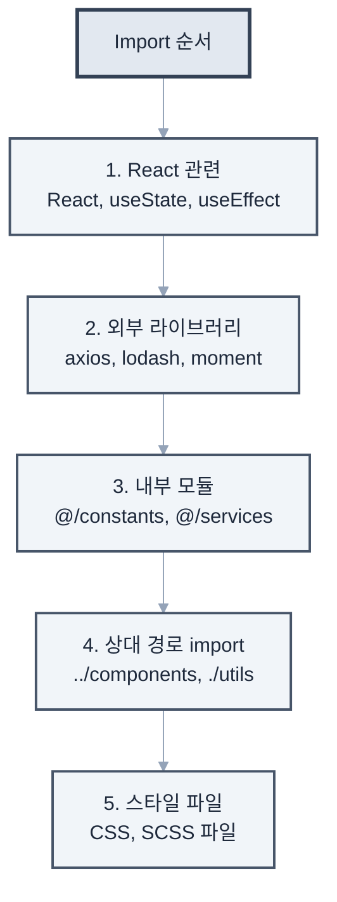

### 주요 파일 위치

- 환경 설정: `.env`, `.env.example`
- API 엔드포인트: `src/services/api.ts`
- 라우팅 설정: `src/routes/index.tsx`
- 전역 스타일: `src/styles/global.css`

### 파일 명명 규칙

- 컴포넌트: PascalCase (예: UserProfile.tsx)
- 유틸리티: camelCase (예: formatDate.ts)
- 상수: UPPER_SNAKE_CASE (예: API_ENDPOINTS.ts)
- 스타일: kebab-case (예: user-profile.module.css)

## 아키텍처 패턴

### 상태 관리

- Redux Toolkit 사용
- 각 기능별로 slice 파일 생성
- RTK Query로 API 상태 관리

### 컴포넌트 구조

```typescript
// 모든 컴포넌트는 다음 구조를 따름
type ComponentProps = {
  // props 정의
};

export const ComponentName: React.FC<ComponentProps> = (props) => {
  // 훅은 최상단에
  // 로직
  // JSX 반환
};
```

## 코딩 스타일

### TypeScript/JavaScript

- 함수명: camelCase
- 컴포넌트명: PascalCase
- 상수: UPPER_SNAKE_CASE
- 파일명: kebab-case.ts

### 명명 규칙 예시

```typescript
// 좋은 예
const getUserData = async (userId: string) => {};
const MAX_RETRY_COUNT = 3;
export const UserProfile: React.FC = () => {};

// 피해야 할 예
const get_user_data = async (userid) => {};
const maxretrycount = 3;
export const userprofile = () => {};
```



### Import 순서

```typescript
import React, { useState, useEffect } from "react";
import { useSelector } from "react-redux";
import axios from "axios";

import { API_ENDPOINTS } from "@/constants";
import { UserService } from "@/services";

import { Button } from "../components";
import "./styles.css";
```

### Error 처리

// 모든 비동기 함수는 try-catch 사용
try {
const data = await fetchData();
return { success: true, data };
} catch (error) {
console.error('Error fetching data:', error);
return { success: false, error: error.message };
}
